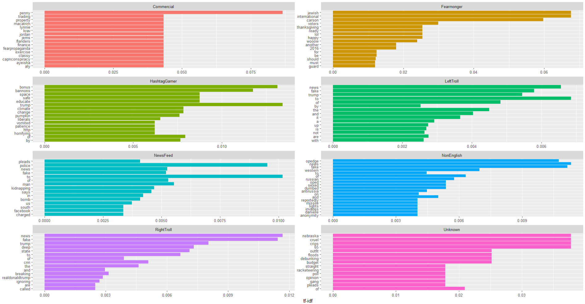
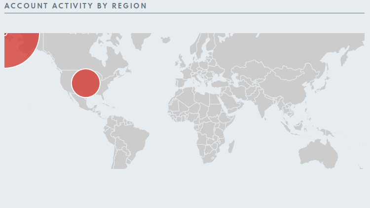
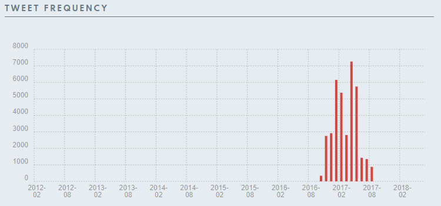
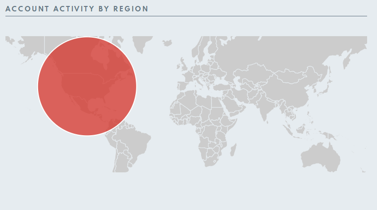
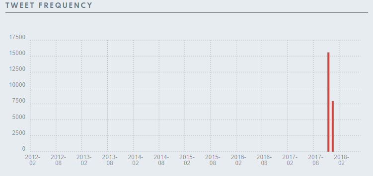
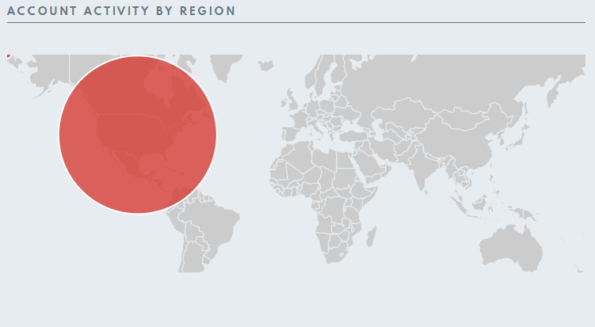
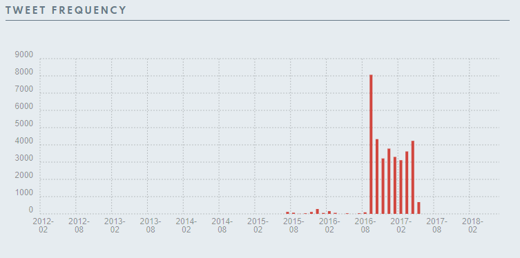
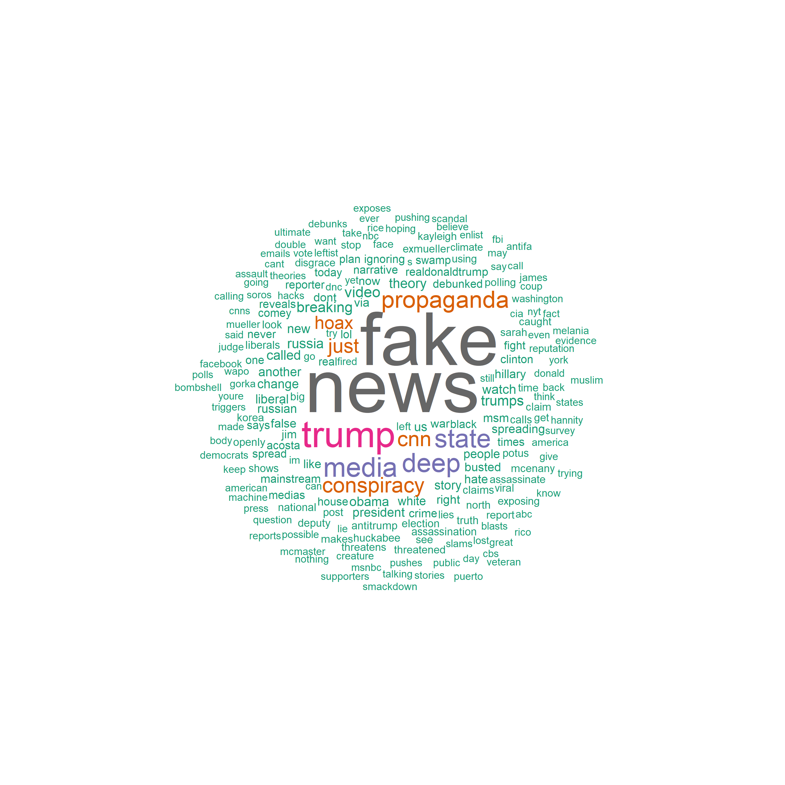
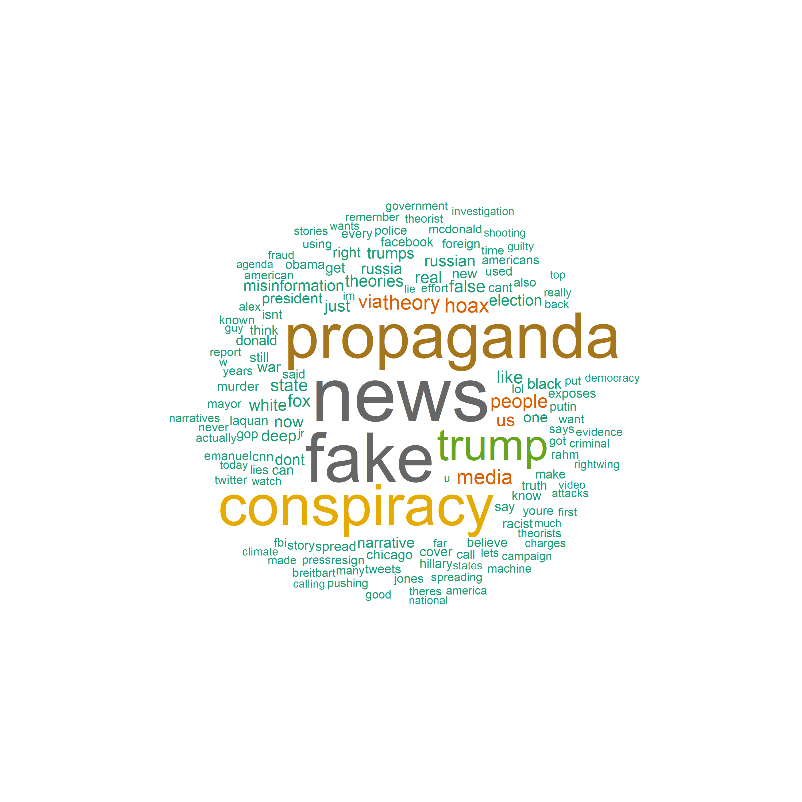
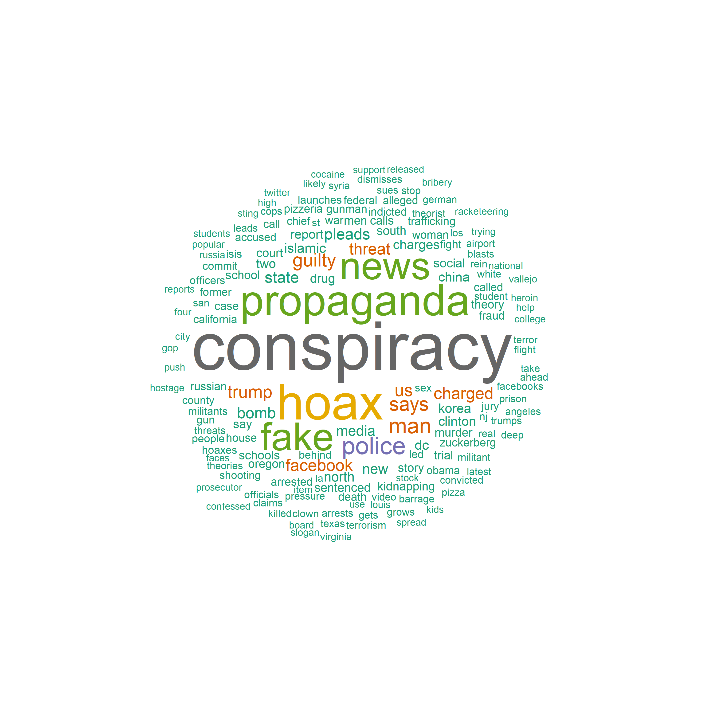

```{r setup, include=FALSE}
knitr::opts_chunk$set(echo = TRUE)
```

# ENTREGA 1: TEXT Y TOPIC MINING: PROPAGACIÓN DE DESINFORMACIÓN Y TEORÍAS DE CONSPIRACIÓN

## AUTOR: Laia Delgado

## GRUPO: MAIS3A


## Objetivo

Mi objetivo es aplicar todo lo visto durante las clases e investigar sobre la propagación de desinformación y teorías de la conspiración.

## Preparación del entorno

Vamos a preparar el entorno con el directorio de trabajo, la declaración de paquetes que vamos a usar y el dataset con el que haremos la práctica.

### Directorio de trabajo

Al ejecutar el notebook es necesario cambiar la ruta a una propia del ordenador donde se ejecute, si no dará error

```{r, warning=FALSE}
setwd("C:/Users/laiad/Desktop/U-tad/CURSO 3/Segundo cuatrimestre/Búsqueda y Análisis de la Información/Entregas/Entrega1")
```

### Paquetes necesarios

```{r message=FALSE, warning=FALSE}
library(quanteda)
library(quanteda.textplots)
library(stringr)
library(quanteda.textstats)
library(tidytext)
library(tidyverse)
library(forcats)
library(scales)
library(SentimentAnalysis)
library(quanteda.dictionaries)
library(syuzhet)
library(dplyr)
library(textdata)
```

### Lectura de ficheros

Al ejecutar el notebook es necesario cambiar la ruta a una propia del ordenador donde se ejecute, si dará error

```{r message=FALSE, warning=FALSE}
ruta_ficheros <- "C:/Users/laiad/Desktop/U-tad/CURSO 3/Segundo cuatrimestre/Búsqueda y Análisis de la Información/Entregas/Entrega1/russian-troll-tweets-master/"

mis_ficheros <- list.files(ruta_ficheros, pattern = "*.csv")
```

### Lectura de Tweets

Rellenamos el dataset datos_twitter con un bucle for. No es la mejor forma ya que si hay algún csv esta mal el bucle parará. Sin embargo, sabemos que todos los csv estan correctamente por lo que es más rápido. La mejor forma sería uno a uno.

```{r message=FALSE, results='hide', warning=FALSE}
datos_twitter <- data.frame()

for (fichero in mis_ficheros) {
    print(fichero)
    datos_twitter <- rbind(read.csv(file = paste0(ruta_ficheros, fichero),
                                    header = TRUE,
                                    sep = ","),
                           datos_twitter)
}
```

## Preprocesamiento de datos y limpieza

Una vez tenemos el dataset con todos los datos vamos a terminar de preparlo. Para ello nos quedaremos sólo con las columnas que aporten información relevante, eliminaremos todo aquello que no aporte nada, filtraremos por un idioma que podamos entender y lo dejaremos todo en un formato que facilite su posterior estudio.

### Resumen

```{r message=FALSE, warning=FALSE}
summary(datos_twitter)
```

Con el summary podemos ver todas las columnas que tiene datos_twitter y eliminar aquellas columnas que no nos aportan nada para nuestra búsqueda y análisis de información.

### Eliminación de columnas no relevantes

Creamos un nuevo dataset a partir de datos_twitter con las columnas que nos interesan. Para ello creamos un subconjunto, df_tweets, a partir de datos_twitter

```{r message=FALSE, warning=FALSE}
df_tweets <- subset(datos_twitter, select = c("author", "content","region","language","publish_date","post_type","account_type","account_category"))
```

### Factorización

Con esto convertimos las variables categóricas a factores para facilitar la búsqueda y análisis

```{r message=FALSE, warning=FALSE}
df_tweets$region <- as.factor(df_tweets$region)
df_tweets$language <- as.factor(df_tweets$language)
df_tweets$post_type <- as.factor(df_tweets$post_type)
df_tweets$account_type <- as.factor(df_tweets$account_type)
df_tweets$account_category <- as.factor(df_tweets$account_category)
```

### Fecha

Cambiamos el formato en el que se encuentran las fechas para que todas esten como mes/dia/año

```{r message=FALSE, warning=FALSE}
df_tweets$publish_date <- as.Date(df_tweets$publish_date,format = "%m/%d/%Y")
```

### Filtración por idioma

Nos interesa trabajar solo con los tweets en inglés ya que son los que podemos entender sin necesidad de traductor

```{r, warning=FALSE}
datos_twitter_ingles <- subset(df_tweets, language == "English")
```

### Limpieza

En esta parte vamos a limpiar el dataset. Esto es quitar información irrelevante, es decir URLs, menciones a otros usuarios, RT, caracteres raros, emojis, etc. y convertir todo a minúsculas para un fácil estudio.

#### Eliminación de URLs

```{r message=FALSE, warning=FALSE}
datos_twitter_ingles$content <- str_replace_all(datos_twitter_ingles$content, 
                                                 pattern = "https?://([^/\\s]++)\\S*+|http?://([^/\\s]++)\\S*+",
                                                 replacement = "")
```

#### Eliminación de links, menciones, RT, etc.

```{r message=FALSE, warning=FALSE}
datos_twitter_ingles$content <- gsub("(#\\w+)|(http\\S+)|(https\\S+)|(&amp;)|(@\\w+)|(RT)", "", datos_twitter_ingles$content)
```

#### Eliminación de caracteres raros, emojis, etc.

```{r message=FALSE, warning=FALSE}
datos_twitter_ingles$content <- gsub("[\\x{1F600}-\\x{1F6FF}|\\x{2600}-\\x{26FF}|\\x{2700}-\\x{27BF}|\\x{1F300}-\\x{1F5FF}|\\x{1F680}-\\x{1F6FF}|\\x{1F1E0}-\\x{1F1FF}|\\x{1F900}-\\x{1F9FF}|\\x{1F7E0}-\\x{1F7FF}|\\x{1F918}]", "", datos_twitter_ingles$content, perl=TRUE)
```

#### Eliminación de caracteres que no son alfanuméricos ni espacios en blanco

```{r message=FALSE, warning=FALSE}
datos_twitter_ingles$content <- gsub("[^[:alnum:][:space:]]", "", datos_twitter_ingles$content, perl=TRUE)
```

Una vez hemos limpiado el dataset, comprobamos si ha quedado relativamente limpio

```{r message=FALSE, results='hide', warning=FALSE}
grep(pattern = "http",datos_twitter_ingles$content,perl = T)
grep(pattern = "#",datos_twitter_ingles$content,perl = T)
```

Por último para facilitar el estudio vamos a poner todo en minúscula

```{r message=FALSE, warning=FALSE}
datos_twitter_ingles$content <- tolower(datos_twitter_ingles$content)
```

### Dataset limpio

Con el dataset limpio y listo para su estudio, lo guardamos

```{r message=FALSE, warning=FALSE}
save(datos_twitter_ingles, file = "datos_twitter_ingles.rda")
```

## Análisis exploratorio de datos

Ya tenemos el dataset con el que vamos a comenzar a trabajar. vamos a centrarnos en la propagación de desinformación y teorías de conspiración. Es por ello que vamos a filtrar el dataset por palabras clave relacionadas con el tema y una vez hecho esto, haremos un análisis de los tweets por account_category, veremos la distribución de la publicación de tweets, un poco de información sobre los autores más activos y por último nos enfocaremos en las categorías más predominantes viendo sus tokens.

Antes de nada cargamos nuestro dataset limpio

```{r message=FALSE, warning=FALSE}
load("datos_twitter_ingles.rda")
```

Primero vamos a filtrar por palabras clave que puedan ayudarnos a centrarnos en el tema principal. Para ello creamos un nuevo dataset con todos los tweets que contengan alguna de las palabras que indiquemos

```{r message=FALSE, warning=FALSE}
tweets_desinformacion <- subset(datos_twitter_ingles, grepl("fake news|conspiracy|hoax|cover-up|secret agenda|hidden truth|government plot|misinformation|propaganda|false narrative|biased reporting|QAnon|9/11 truth|moon landing hoax|deep state", content))
```

### Gráficos

#### Categorías

Ahora que ya tenemos un dataset con la información filtrada, vamos a ver las categorías que hay (account_category) así como la frecuencia de cada una de ellas

```{r message=FALSE, warning=FALSE}
tweets_desinformacion %>%
  ggplot(aes(x = account_category)) +
  geom_bar(fill = "skyblue", color = "black") +
  labs(title = "Distribución tweets_desinformacion por account_category",
       x = "Categoría",
       y = "Frecuencia") +
  theme_minimal() +
  theme(axis.text.x = element_text(angle = 45, hjust = 1))
```

Podemos observar como la categoría más predominante con clara diferencia es RightTroll seguido de LeftTroll y NewsFeed (aunque hay mucha diferencia entre el primero y segundo), asi que dentro del tema principal sobre desinsformación y conspiración, vamos a centrarnos en estas tres categorías, donde además compareremos RightTroll y LeftTroll.

Dados los resultados, se podría decir que la ideología de derechas tiene una gran presencia en Twitter por lo que serían las mayores responsbles en propagar desinformación y teorías de conspiración. Además podría indicar una polarización significativa donde las personas de derechas tienen mayor presencia que otras ideologías como las de izquierdas. Por otra parte que NewsFeed sea la tercera categoría más frecuente tiene sentido ya que es un tipo de cuenta que se encarga de difundir información y noticias. Puede hacer que la gente tome consciencia de que deben contrastar información con otras fuente o por el contrario ser ellos mismos los que propaguen desinformación para interferir en la opinión pública.

También es importante destacar que en el conjunto de Twitter Trolls, la categoría RightTroll siempre tiene mayor información que el resto.

##### Palabras más frecuentes

Para seguir estudiando las categorías, vamos a ver cómo se distribuye por cada una de ellas el uso de palabras más frecuentes

Preparamos los datos para realizar el análisis de las palabras más frecuentes en tweets_desinformacion, organizando la información por categorías.

Para ello eliminamos retweets, caracteres espciales de HTML, menciones y hastags.

```{r message=FALSE, warning=FALSE}
tidy_tweets_desinformacion <- tweets_desinformacion %>%
  filter(!str_detect(content, "^RT")) %>%
  mutate(content = str_remove_all(content, "&amp;|&lt;|&gt;")) %>% 
  mutate(content = str_remove_all(content, "[@#]\\w+"))
```

Calculamos la frecuecia de cada palabra por categoria, las palabras totales por categoría y en twitter_words unimos twitter_words con total_words utilizando account_category como clave de unión

```{r message=FALSE, warning=FALSE}
twitter_words <- tidy_tweets_desinformacion %>%
  unnest_tokens(word, content) %>%
  count(account_category, word, sort = TRUE) 

total_words <- twitter_words %>% 
  group_by(account_category) %>% 
  summarize(total = sum(n))

twitter_words <- left_join(twitter_words, total_words)
```

Mostramos el gráfico donde se muestra la frecuencia relativa de cada palabra por categoría

```{r message=FALSE, warning=FALSE}
ggplot(twitter_words, 
       aes(n/total, fill = account_category)) +
  geom_histogram(show.legend = FALSE) +
  xlim(NA, 0.0009) +
  facet_wrap(~account_category, 
             ncol = 2, 
             scales = "free_y")
```

Tanto Commercial como Fearmonger y Unknown no usan ninguna de las palabras más frecuentes. El resto de categorías sí que hace uso de estas palabras siendo RightTroll y LeftTroll las que más tweets tienen con las palabras más frecuentes, seguido de NewsFeed, esto cuadra con los resultados vistos donde estas tres catergorías eran las que predominaban.

Podemos calcular el TF-IDF (Frecuencia de Término - Frecuencia Inversa de Documento) para twitter_words. Esto es una medida estadítica para evaluar la importancia de una palabra en un documento, en relación con una colección de documentos más grande.

Es decir, para nuestro caso destacaremos las palabras más importantes para cada account_category y no tienen porqué ser las palabras más importantes de todo el conjunto de datos.

```{r message=FALSE, warning=FALSE}
tweet_tf_idf <- twitter_words %>%
  bind_tf_idf(word, account_category, n)
```

Después visualizamos las 15 palabras con mayor TF-IDF para cada account_cattegory

```{r message=FALSE, warning=FALSE, fig.show='hide'}
tweet_tf_idf %>%
  group_by(account_category) %>%
  slice_max(tf_idf, 
            n = 15) %>%
  ungroup() %>%
  ggplot(aes(tf_idf, fct_reorder(word, tf_idf), 
             fill = account_category)) +
  geom_col(show.legend = FALSE) +
  facet_wrap(~account_category, ncol = 2, scales = "free") +
  labs(x = "tf-idf", y = NULL)
```



Podemos encontrar algunas palabras que no aportan nada de información relevante como las preposiciones, conjunciones, determiandos verbos, pronombres o artículos. Esto es porque no hemos elimnado las stopwords, pero estas se eliminan con los tokens y aún no hemos llegado a esa parte.

Más adelante haremos un wordcloud para las palabras más frecuentes de RightTroll, LeftTroll y NewsFeed, Sin embargo que sean las más frecuentes no significa que sean las más importantes. Estas palabras se pueden ver con el TF-IDF, aunque es verdad que justo para LeftTroll la mayoría de las palabras que han salido como más importantes no aportan nada.

Vamos a sacar algunas conclusiones de cada categoría

*Commercial*

Tendencia hacia lo comercial: Las palabras como "finance", "trading" y "property" sugieren un enfoque en temas financieros y comerciales.

Nombres o términos específicos: Palabras como "jems", "lynnie" y "flanders" podrían ser nombres propios o términos específicos relacionados con actividades comerciales.

Propaganda o temor relacionado con negocios: La presencia de palabras como "fearpropaganda" y "penny" podría indicar la promoción de temores o propaganda relacionada con el comercio y las finanzas.

Referencias a personas o personajes: Los nombres como "jordan" y "aly" podrían estar relacionados con figuras prominentes en el ámbito comercial o personas influyentes en este sector.

*Fearmonger*

Enfoque en temas polémicos: La presencia de palabras como "international", "jewish" y "voters" sugiere un enfoque en temas sensibles y potencialmente polémicos, como asuntos internacionales y cuestiones relacionadas con la comunidad judía y los votantes.

Posible manipulación emocional: Las palabras como "happy", "lol" y "thanksgiving" podrían indicar un intento de generar emociones específicas en la audiencia, posiblemente utilizando el humor o la celebración para influir en la percepción de ciertos temas.

Referencia al pasado: La presencia de "2016" sugiere un enfoque en eventos pasados, lo que podría implicar la revisión o la reinterpretación de eventos históricos en un contexto contemporáneo.

Posible intención de persuasión: Palabras como "should", "must" y "for" podrían indicar un intento de persuadir o convencer a la audiencia sobre ciertos puntos de vista o acciones que se consideran necesarias o deseables.

*HashtagGamer*

Enfoque en temas políticos: La presencia de palabras como "trump", "bannons", "climate" y "liberals" sugiere un enfoque en temas políticos, especialmente relacionados con la administración Trump y cuestiones relacionadas con el cambio climático.

Promoción de ideas y valores: Palabras como "educate", "safe", "space" y "patience" sugieren un interés en la promoción de la educación, la seguridad y la paciencia como valores o conceptos importantes.

Referencias culturales y de entretenimiento: La presencia de palabras como "pumpkin" y "horrifying" sugiere posibles referencias a eventos culturales o de entretenimiento, aunque su significado preciso puede depender del contexto en el que se utilicen.

*LeftTroll*

Énfasis en la desinformación: Palabras como "fake" y "news" sugieren un énfasis en la difusión de noticias falsas o desinformación como parte de una estrategia para influir en la opinión pública.

Referencias a Trump: La presencia de "trump" indica que los tweets pueden abordar temas relacionados con el expresidente Donald Trump, ya sea en apoyo o en crítica.

*NewsFeed*

Noticias sensacionalistas: Palabras como "fake", "news", "police", "kidnapping", "bomb", "charged" sugieren un énfasis en noticias sensacionalistas o crímenes que involucran a la policía, bombas, cargos legales, etc.

Presencia de plataformas y lugares: La presencia de "facebook" y "south" indica que los tweets pueden mencionar eventos o temas relacionados con la plataforma de redes sociales Facebook o eventos que ocurran en el sur.

*NonEnglish*

Falsas noticias y opinión: Las palabras "news", "fake" y "oped" sugieren la presencia de noticias falsas y opiniones editoriales en los tweets de esta categoría.

Referencias geopolíticas: Palabras como "western", "russian" y "antirussia" indican un enfoque en asuntos geopolíticos, posiblemente relacionados con la percepción occidental o rusa.

Términos no específicos: Algunas palabras, como "sexed", "dumbed", "invades", "missile", "lights", "reportedly", no proporcionan una indicación clara del tema, pero podrían estar relacionadas con eventos específicos o narrativas dentro de la categoría.

*RightTroll*

Política y noticias: Las palabras "news", "fake", "trump", "cnn" y "realdonaldtrump" sugieren un enfoque en la política y las noticias, con una posible inclinación hacia narrativas favorables al presidente Trump y críticas a los medios de comunicación convencionales como CNN.

Teorías de conspiración: La presencia de "deep state" sugiere la promoción de teorías de conspiración relacionadas con la idea de un "estado profundo" que opera detrás de escena para influir en la política y los eventos mundiales.

Negación y desacreditación: Palabras como "ignoring" y "called" indican una actitud de negación o desacreditación hacia ciertos eventos, narrativas o figuras públicas.

*Unknown*

Diversidad temática: Las palabras no parecen seguir un tema claro o coherente. Se mencionan términos como "crips", "gang", "debunking", "floods" y "nebraska", lo que indica una variedad de temas que van desde cuestiones sociales y criminales hasta eventos naturales y lugares geográficos.

Posible desinformación: La presencia de palabras como "debunking" sugiere la posibilidad de que se esté discutiendo o desacreditando ciertos conceptos o narrativas. Esto podría indicar un intento de difundir información errónea o desacreditar información legítima.

#### Ley de Zipf

Podemos realizar un análisis de la distribución de frecuencia de los términos con la ley de Zipf.

Esta ley es un fénomeno empírico que describe la distribución de la frecuencia de las palabras en un texto, donde la frecuencia de cualquier palabra es inversamente proporcional a su rango de frecuencia. En otras palabras, la palabra más frecuente en un texto ocurre aproximadamente el doble de veces que la segunda palabra más frecuente, tres veces más que la tercera, y así sucesivamente.

Para ello, agrupamos por account_category y calculamos la frecuencia relativa de cada palabra en relación con el total de palabras.

```{r message=FALSE, warning=FALSE}
freq_by_rank <- twitter_words %>% 
  group_by(account_category) %>% 
  mutate(rank = row_number(), 
         term_frequency = n/total) %>%
  ungroup()
```

Ahora calculamos la regresión lineal de logaritmo de la frecuencia relativa en funcion del logaritmo del rango para cada account_category y generamos el gráfico

```{r message=FALSE, warning=FALSE}
zipf <- lm(log10(term_frequency) ~ log10(rank), 
   data = freq_by_rank)

summary(zipf)

freq_by_rank %>% 
  ggplot(aes(rank, 
             term_frequency, 
             color = account_category)) + 
  geom_abline(intercept = 0.951902, 
              slope = -1.554990, 
              color = "gray50", linetype = 2) +
  geom_line(linewidth = 1.1, 
            alpha = 0.8, 
            show.legend = FALSE) + 
  scale_x_log10() +
  scale_y_log10()
```

Podemos ver que la línea discontinua representa la distribución predicha por la ley de Zipf, mientras que el resto de lineas de colores corresponden con cada una de las categorías. Además también se aprecia como algunas lineas terminan mucho antes que otras, esto quiere decir que la frecuencia es menor. 

Por lo tanto podriamos deducir por lo visto anteoriormente, que lla linea morada es de RightTroll, la verde oscuro (más larga) es LeftTroll y la azul claro (más larga), NeewsFeed.

Viendo la gráfica, no parece que se siga mucho lo predicho por la ley de Zipf. Los que más se puede aproximar son las tres categorías con mas tweets, sobre todo cuando las rectas llegan a su final. De hecho tanto RightTroll como LeftTroll estan basatante superpuestas entre ellas hasta que llegan al final.

Sin embargo, aunque no sigan la ley de Zipf si que parece que practicamente todas las categorías siguen una misma distribución, ya que las rectas que muestran su distribución son bastante similares.

#### Fechas

Después de estudiar las categorías, vamos a ver en qué fechas se publicaron más tweets sobre nuestro tema principal

```{r message=FALSE, warning=FALSE}
tweets_desinformacion %>%
  ggplot(aes(x = publish_date)) +
  geom_histogram(fill = "skyblue", color = "black", bins = 30) +
  labs(title = "Distribución de publicación de tweets_desinformacion",
       x = "Fecha de publicación",
       y = "Frecuencia") +
  theme_minimal()
```

Podemos osbervar que la publicación de tweets centrados en la propagación de desinformación y teorías de conspiración aumentaron signficativamente hacia 2017 habiendo un claro pico hacia 2018 (no queda muy claro si es en 2017 0 2018).

No obstante como no queda muy claro cuando terminan las barras de un año a otro vamos a ver con mayor detalle desde 2016 hasta 2018.

##### 2016

```{r message=FALSE, warning=FALSE}
tweets_desinformacion_2016 <- tweets_desinformacion %>%
  filter(year(publish_date) == 2016)

ggplot(tweets_desinformacion_2016, aes(x = publish_date)) +
  geom_histogram(fill = "skyblue", color = "black", bins = 12) +  # Cambia el número de bins a 12 para representar cada mes del año
  labs(title = "Distribución de publicación de tweets_desinformacion en 2016",
       x = "Fecha de publicación",
       y = "Frecuencia") +
  theme_minimal()
```

Se aprecia un aumento significativo en noviembre de 2016, esto seguramente se deba a las elecciones de Estados Unidos donde ganó Trump.

A continuación dejo los links donde he encontrado la información de los eventos acontencidos en 2016:

-   <https://www.bbc.com/mundo/noticias-internacional-37917098>

##### 2017

```{r message=FALSE, warning=FALSE}
tweets_desinformacion_2017 <- tweets_desinformacion %>%
  filter(year(publish_date) == 2017)

ggplot(tweets_desinformacion_2017, aes(x = publish_date)) +
  geom_histogram(fill = "skyblue", color = "black", bins = 12) +  # Cambia el número de bins a 12 para representar cada mes del año
  labs(title = "Distribución de publicación de tweets_desinformacion en 2017",
       x = "Fecha de publicación",
       y = "Frecuencia") +
  theme_minimal()
```

En 2017, encontramos el pico durante el mes de agosto. Haciendo una búsqueda sobre los eventos que pudieron provocar el aumento de tweets durante dicho mes, he encontrado las protestas en Charlottesville donde se produjeron violentos enfrentamientos en Charlottesville, Virgnia, entre manifestantes de extrema derecha y contra-manifestantes. Otra posible causa pudo haber sido la tensión con Corea del Norte ya que hubo intercambios de amenazas belicosas entre Estados Unidos y Corea del Norte.

A continuación dejo los links donde he encontrado la información de los eventos acontencidos en 2017:

-   <https://www.bbc.com/mundo/noticias-internacional-45150258>
-   <https://www.bbc.com/mundo/noticias-internacional-39635281>

##### 2018

```{r message=FALSE, warning=FALSE}
tweets_desinformacion_2018 <- tweets_desinformacion %>%
  filter(year(publish_date) == 2018)

ggplot(tweets_desinformacion_2018, aes(x = publish_date)) +
  geom_histogram(fill = "skyblue", color = "black", bins = 12) +  # Cambia el número de bins a 12 para representar cada mes del año
  labs(title = "Distribución de publicación de tweets_desinformacion en 2018",
       x = "Fecha de publicación",
       y = "Frecuencia") +
  theme_minimal()
```

Para 2018 encontramos mayor activad durante el mes de febrero. Esto se puede deber a las tensiones políticas entre Estados Unidos y Corea del Norte continuadas del año pasado, cambios en la política interna de Estados Unidos donde se crearon movimientos sociales y protestas en contra de el entonces presidente Trump así como algunos escándalos políticos.

A continuación dejo los links donde he encontrado la información de los eventos acontencidos en 2018:

-   <https://elpais.com/internacional/2018/01/20/estados_unidos/1516475589_071331.html#>
-   <https://es.wikipedia.org/wiki/Marcha_de_las_Mujeres_de_2018>
-   <https://www.bbc.com/mundo/noticias-internacional-43092239>
-   <https://www.bbc.com/mundo/noticias-internacional-43150311>

#### Autores

Al ser tanta cantidad de datos va a ser practicamente ilegible los nombres de usuario si hacemos un gráfico o tabla con todos los usuarios que han publicado tweets sobre propagación de desinformación y teorías de conspiración. Así que vamos a hacerlo sólo para los 40 más acitvos.

Para ello primero obtenemos los 40 usuarios con más tweets, para ello vamos a usar una sintaxis algo similar a una query

```{r message=FALSE, warning=FALSE}
top_autores <- tweets_desinformacion %>%
  group_by(author) %>%
  summarise(num_tweets = n()) %>%
  arrange(desc(num_tweets)) %>%
  top_n(40)
```

Una vez tenemos el top, hacemos el gráfico

```{r message=FALSE, warning=FALSE}
ggplot(top_autores, aes(x = reorder(author, num_tweets), y = num_tweets)) +
  geom_bar(stat = "identity", fill = "skyblue", color = "black") +
  labs(title = "Top 40 Usuarios Más Activos",
       x = "Autor",
       y = "Número de Tweets") +
  theme(axis.text.x = element_text(angle = 45, hjust = 1))  
```

En el gráfico se observa como la mayoría de usuarios tiene menos de 100 tweets publicados. El top 9 (aproxiamadamente) de los usuarios pasan de los 100 tweets y el usuario con más teewts con diferencia es WORLDNEWSOLI con aproximadamente 550.

Para tener algo más de información acerca de los usuarios voy a buscar para los tres primeros:

#### WORLDNEWPOLI

Si buscamos en Internet el nombre del usuario más activo encontramos lo siguiente como descripción:

La cuenta de Twitter @worldnewspoli es una cuenta creada por la Agencia de Investigación de Internet, una "fábrica de trolls" operada en nombre del gobierno ruso. Formaba parte de una campaña para influir en la política y las elecciones en Occidente, especialmente en los Estados Unidos.

Además podemos encontrar que esta cuenta es de la categoría RightTroll y las siguientes imágenes





La información acerca del usuario la he encontrado en la siguiente página:

-   <https://russiatweets.com/author/WORLDNEWSPOLI>

#### COVFEFENATIONUS

Si buscamos en Internet el nombre del usuario más activo encontramos lo siguiente como descripción:

La cuenta de Twitter @worldnewspoli es una cuenta creada por la Agencia de Investigación de Internet, una "fábrica de trolls" operada en nombre del gobierno ruso. Formaba parte de una campaña para influir en la política y las elecciones en Occidente, especialmente en los Estados Unidos.

Además podemos encontrar que esta cuenta es de la categoría RightTroll y la siguiente imagen





La información acerca del usuario la he encontrado en la siguiente página:

-   <https://russiatweets.com/author/COVFEFENATIONUS>

#### AMELIEBALDWIN

Si buscamos en Internet el nombre del usuario más activo encontramos lo siguiente como descripción:

La cuenta de Twitter @worldnewspoli es una cuenta creada por la Agencia de Investigación de Internet, una "fábrica de trolls" operada en nombre del gobierno ruso. Formaba parte de una campaña para influir en la política y las elecciones en Occidente, especialmente en los Estados Unidos.

Además podemos encontrar que esta cuenta es de la categoría RightTroll y la siguiente imagen





La información acerca del usuario la he encontrado en la siguiente página:

-   <https://russiatweets.com/author/AMELIEBALDWIN>

### RightTroll

Nos quedamos con todos aquellos que tengan como account_category RightTroll

```{r message=FALSE, warning=FALSE}
ds_right_troll <- subset(tweets_desinformacion, account_category == "RightTroll")
save(ds_right_troll, file = "ds_right_troll.rda")
```

#### Corpus

Con el dataset filtrado creamos un corpus, necesario parar poder generar los tokens

```{r message=FALSE, warning=FALSE}
corpus_right_troll <- quanteda::corpus(ds_right_troll$content)
save(corpus_right_troll, file = "corpus_right_troll.rda")
```

Ahora creamos metadatos, docvars, que vamos a necesitar

```{r message=FALSE, warning=FALSE}
docvars(corpus_right_troll, "account_category") <- corpus_right_troll$account_category
docvars(corpus_right_troll, "account_type") <- corpus_right_troll$account_type
docvars(corpus_right_troll, "lengua") <- corpus_right_troll$language
docvars(corpus_right_troll,"fecha") <- corpus_right_troll$publish_date
docvars(corpus_right_troll,"autor") <- corpus_right_troll$author
docvars(corpus_right_troll,"region") <- corpus_right_troll$region
docvars(corpus_right_troll,"post_type") <- corpus_right_troll$post_type
```

#### Tokens

Vamos a buscar los tokens más predominantes a partir del corpus creado. Para ello generamos los tokens

```{r message=FALSE, warning=FALSE}
corpus_right_troll <- tokens(corpus_right_troll)
```

Ahora que tenemos los tokens generados, podemos buscar todos los mensajes relacionados con fake news, conspiracy y hoax (nuestras palabras clave)

```{r message=FALSE, warning=FALSE}
right_troll_tokens <- list(
  fake_news_tweets = kwic(corpus_right_troll, "fakenews"),
  conspiracy_tweets = kwic(corpus_right_troll, "conspiracy"),
  hoax_tweets = kwic(corpus_right_troll, "hoax")
)
```

Vamos a generar los tokens limpios

```{r message=FALSE, warning=FALSE}
right_troll_tokens_clean <- quanteda::tokens(corpus_right_troll,
                                what="word",
                                remove_numbers=TRUE,
                                remove_punct=TRUE,
                                remove_symbols=TRUE,
                                remove_separators=TRUE,
                                remove_url=TRUE)
```

A paritr de los tokens limpios, vamos a quitar stopwords. Esto son palabras como preposiciones, contracciones, etc.

```{r message=FALSE, warning=FALSE}
right_troll_tokens_clean <-tokens_select(right_troll_tokens_clean,
                           pattern = stopwords("en"),
                           selection = "remove")
```

#### WordCloud

Creamos una matriz de frecuencia que contiene los tokens y su aparición en el dataset

```{r message=FALSE, warning=FALSE}
myStemMat <-dfm(right_troll_tokens_clean)
```

Ahora vamos a hacer un Word Cloud, para ver los temas principales. Se podría hacer con `topfeatures(myStemMat,100)` donde nos saldrían los datos de cada tema con su frecuencia respectiva. Sin embargo con el World Cloud queda de una forma más agradable, aunque no sepamos con certeza cual es la frecuencia determinada.

```{r message=FALSE, results='hide', warning=FALSE}
set.seed(100)

png(filename="right_troll.png",
    width=3000,
    height=3000)

textplot_wordcloud(myStemMat, 
                   min_count = 50, 
                   random_order = FALSE,
                   rotation = 0,
                   color = RColorBrewer::brewer.pal(8,"Dark2"))

dev.off()
```



Se aprecia que los temas más frecuentes son:

-   fake news
-   trump
-   media
-   deep
-   state
-   propaganda
-   conspiracy
-   cnn
-   just
-   hoax

Enfoque en la deslegitimación de la prensa: Las palabras "fake news", "media" y "cnn" sugieren un enfoque en desacreditar a los medios de comunicación tradicionales y propagar la idea de que los principales medios de comunicación están involucrados en la difusión de noticias falsas.

Foco en la conspiración y la propaganda: La presencia de palabras como "conspiracy", "propaganda" y "deep state" sugiere un interés en promover teorías de conspiración y la idea de que hay fuerzas ocultas o agendas detrás de los eventos políticos y sociales.

Apoyo a Trump: La aparición frecuente de "trump" sugiere un fuerte apoyo o interés en el presidente Donald Trump y posiblemente la promoción de su agenda política a través de los tweets.

Uso de términos sensacionalistas: Palabras como "hoax" y "just" pueden indicar un uso de términos sensacionalistas para captar la atención del público y fomentar la desconfianza en las instituciones establecidas.

### LeftTroll

Nos quedamos con todos aquellos que tengan como account_category LeftTroll

```{r message=FALSE, warning=FALSE}
ds_left_troll <- subset(tweets_desinformacion, account_category == "LeftTroll")
save(ds_left_troll, file = "ds_left_troll.rda")
```

#### Corpus

Con el dataset filtrado creamos un corpus, necesario parar poder generar los tokens

```{r message=FALSE, warning=FALSE}
corpus_left_troll <- quanteda::corpus(ds_left_troll$content)
save(corpus_left_troll, file = "corpus_left_troll.rda")
```

Ahora creamos metadatos, docvars, que vamos a necesitar

```{r message=FALSE, warning=FALSE}
docvars(corpus_left_troll, "account_category") <- corpus_left_troll$account_category
docvars(corpus_left_troll, "account_type") <- corpus_left_troll$account_type
docvars(corpus_left_troll, "lengua") <- corpus_left_troll$language
docvars(corpus_left_troll,"fecha") <- corpus_left_troll$publish_date
docvars(corpus_left_troll,"autor") <- corpus_left_troll$author
docvars(corpus_left_troll,"region") <- corpus_left_troll$region
docvars(corpus_left_troll,"post_type") <- corpus_left_troll$post_type
```

#### Tokens

Vamos a buscar los tokens más predominantes a partir del corpus creado. Para ello generamos los tokens

```{r message=FALSE, warning=FALSE}
corpus_left_troll <- tokens(corpus_left_troll)
```

Ahora que tenemos los tokens generados, podemos buscar todos los mensajes relacionados con fake news, conspiracy y hoax (nuestras palabras clave)

```{r message=FALSE, warning=FALSE}
corpus_left_troll_tokens <- list(
  fake_news_tweets = kwic(corpus_left_troll, "fakenews"),
  conspiracy_tweets = kwic(corpus_left_troll, "conspiracy"),
  hoax_tweets = kwic(corpus_left_troll, "hoax")
)
```

Vamos a limpiarlo

```{r message=FALSE, warning=FALSE}
left_troll_tokens_clean <- quanteda::tokens(corpus_left_troll, # Corpus
                                what="word",
                                remove_numbers=TRUE,
                                remove_punct=TRUE,
                                remove_symbols=TRUE,
                                remove_separators=TRUE,
                                remove_url=TRUE)
```

A paritr de los tokens limpios, vamos a quitar stopwords. Esto son palabras como preposiciones, contracciones, etc.

```{r message=FALSE, warning=FALSE}
left_troll_tokens_clean <-tokens_select(left_troll_tokens_clean,
                           pattern = stopwords("en"),
                           selection = "remove")
```

#### WordCloud

Creamos una matriz de frecuencia que contiene los tokens y su aparición en el dataset

```{r message=FALSE, warning=FALSE}
myStemMat <-dfm(left_troll_tokens_clean)
```

Ahora vamos a hacer un Word Cloud, para ver los temas principales. Se podría hacer con `topfeatures(myStemMat,100)` donde nos saldrían los datos de cada tema con su frecuencia respectiva. Sin embargo con el World Cloud queda de una forma más agradable, aunque no sepamos con certeza cual es la frecuencia determinada.

```{r message=FALSE, results='hide', warning=FALSE}
set.seed(100)

png(filename="left_troll.png",
    width=3000,
    height=3000)

textplot_wordcloud(myStemMat, 
                   min_count = 10, 
                   random_order = FALSE,
                   rotation = 0,
                   color = RColorBrewer::brewer.pal(8,"Dark2"))

dev.off()
```



Se aprecia que los temas más frecuentes son:

-   fake news
-   propaganda
-   conspiracy
-   trump
-   theory
-   media
-   hoax
-   people
-   via

Enfoque en la deslegitimación de la prensa: Al igual que en los tweets de RightTroll, la presencia de "fake news" y "media" sugiere un enfoque en desacreditar a los medios de comunicación tradicionales y propagar la idea de que difunden información falsa.

Promoción de teorías de conspiración: La aparición de "conspiracy" y "theory" indica un interés en promover teorías de conspiración y la idea de que hay fuerzas ocultas o agendas detrás de los eventos políticos y sociales.

Críticas a Trump: Aunque menos frecuente que en los tweets de RightTroll, la presencia de "trump" sugiere críticas o desaprobación hacia el presidente Donald Trump.

Uso de términos sensacionalistas: Al igual que en los tweets de RightTroll, el uso de palabras como "hoax" y "propaganda" sugiere un intento de utilizar un lenguaje sensacionalista para captar la atención del público y promover una agenda política específica.

Énfasis en la participación ciudadana: La presencia de "people" y "via" podría indicar un énfasis en la participación ciudadana y la difusión de información a través de las redes sociales.

### NewsFeed

Nos quedamos con todos aquellos que tengan como account_category NewsFeed

```{r message=FALSE, warning=FALSE}
ds_news_feed <- subset(tweets_desinformacion, account_category == "NewsFeed")
save(ds_news_feed, file = "ds_news_feed.rda")
```

#### Corpus

Con el dataset filtrado creamos un corpus, necesario parar poder generar los tokens

```{r message=FALSE, warning=FALSE}
corpus_news_feed <- quanteda::corpus(ds_news_feed$content)
save(corpus_news_feed, file = "corpus_news_feed.rda")
```

Ahora creamos metadatos, docvars, que vamos a necesitar

```{r message=FALSE, warning=FALSE}
docvars(corpus_news_feed, "account_category") <- corpus_news_feed$account_category
docvars(corpus_news_feed, "account_type") <- corpus_news_feed$account_type
docvars(corpus_news_feed, "lengua") <- corpus_news_feed$language
docvars(corpus_news_feed,"fecha") <- corpus_news_feed$publish_date
docvars(corpus_news_feed,"autor") <- corpus_news_feed$author
docvars(corpus_news_feed,"region") <- corpus_news_feed$region
docvars(corpus_news_feed,"post_type") <- corpus_news_feed$post_type
```

#### Tokens

Vamos a buscar los tokens más predominantes a partir del corpus creado. Para ello generamos los tokens

```{r message=FALSE, warning=FALSE}
corpus_news_feed <- tokens(corpus_news_feed)
```

Ahora que tenemos los tokens generados, podemos buscar todos los mensajes relacionados con fake news, conspiracy y hoax (nuestras palabras clave)

```{r message=FALSE, warning=FALSE}
corpus_news_feed_tokens <- list(
  fake_news_tweets = kwic(corpus_news_feed, "fakenews"),
  conspiracy_tweets = kwic(corpus_news_feed, "conspiracy"),
  hoax_tweets = kwic(corpus_news_feed, "hoax")
)
```

Vamos a limpiarlo

```{r message=FALSE, warning=FALSE}
news_feed_tokenss_clean <- quanteda::tokens(corpus_news_feed, # Corpus
                                what="word",
                                remove_numbers=TRUE,
                                remove_punct=TRUE,
                                remove_symbols=TRUE,
                                remove_separators=TRUE,
                                remove_url=TRUE)
```

A paritr de los tokens limpios, vamos a quitar stopwords. Esto son palabras como preposiciones, contracciones, etc.

```{r message=FALSE, warning=FALSE}
news_feed_tokenss_clean <-tokens_select(news_feed_tokenss_clean,
                           pattern = stopwords("en"),
                           selection = "remove")
```

#### WordCloud

Creamos una matriz de frecuencia que contiene los tokens y su aparición en el dataset

```{r message=FALSE, warning=FALSE}
myStemMat <-dfm(news_feed_tokenss_clean)
```

Ahora vamos a hacer un Word Cloud, para ver los temas principales. Se podría hacer con `topfeatures(myStemMat,100)` donde nos saldrían los datos de cada tema con su frecuencia respectiva. Sin embargo con el World Cloud queda de una forma más agradable, aunque no sepamos con certeza cual es la frecuencia determinada.

```{r message=FALSE, results='hide', warning=FALSE}
set.seed(100)

png(filename="news_feed.png",
    width=3000,
    height=3000)

textplot_wordcloud(myStemMat, 
                   min_count = 5, 
                   random_order = FALSE,
                   rotation = 0,
                   color = RColorBrewer::brewer.pal(8,"Dark2"))

dev.off()
```



Se aprecia que los temas más frecuentes son:

-   conspiracy
-   hoax
-   propaganda
-   fake news
-   police
-   man
-   says
-   guilty
-   us
-   trump
-   facebook
-   charged
-   threat

Enfoque en teorías de conspiración y desinformación: La presencia destacada de términos como "conspiracy", "hoax", "propaganda" y "fake news" sugiere un enfoque en la difusión de teorías de conspiración y desinformación.

Énfasis en temas relacionados con la policía y la justicia: Las palabras "police", "guilty", "charged" y "threat" sugieren un interés en noticias relacionadas con la aplicación de la ley, posiblemente con un enfoque sensacionalista en crímenes y amenazas.

Inclusión de nombres y entidades prominentes: La presencia de términos como "trump", "facebook" y "us" sugiere un interés en eventos o personas prominentes en la política y la sociedad estadounidense, lo que podría indicar una estrategia de captar la atención del público mediante noticias relevantes.

Énfasis en la viralidad y el impacto emocional: El uso de términos como "says" y "man" podría indicar un enfoque en historias virales o anecdóticas que generan interés público, posiblemente con un impacto emocional en la audiencia.

## Análisis de sentimientos

Una vez hemos visto de forma más general los datos de tweets_desinformacion, vamos a explorar en mayor profundidad. Lo primero que vamos a hacer es comparar RightTroll y LeftTroll ya que son dos categorías totalmente opuestas y por lo tanto polarizadas.

### RightTroll vs LeftTroll

Previamente habiamos visto la distribución de publicaciones a lo largo del tiempo para cualquier categoría. Ahora vamos a ver la distribución de tweets, pero para RightTroll y LeftTroll ya que vamos a compararlos

```{r message=FALSE, warning=FALSE}
tidy_tweets_desinformacion %>%
  unnest_tokens(word, content) %>%
  filter(!word %in% stop_words$word,
         !word %in% str_remove_all(stop_words$word, "'"),
         str_detect(word, "[a-z]")) -> tokens_politica

frequency <- tokens_politica %>% 
  count(account_category, 
        word, 
        sort = TRUE) %>% 
  left_join(tokens_politica %>% 
              count(account_category, 
                    name = "total")) %>%
  mutate(freq = n/total)
```

Mostramos el gráfico

```{r message=FALSE, warning=FALSE}
categorias <- c("RightTroll", "LeftTroll")

right_left <- tweets_desinformacion %>%
  filter(publish_date > as.Date("2015-01-01")
         & (account_category  %in% categorias))

ggplot(right_left, 
       aes(x = publish_date, 
           fill = account_category)) +
  geom_histogram(position = "identity", 
                 bins = 20, 
                 show.legend = F) +
  facet_wrap(~account_category, ncol = 1)
```

Se observa como hemos podido ver anteriormente que RightTroll tiene una mayor actividad. LeftTroll es bastante constante en cuanto a la publicación de tweets, no llega ni a 500. En cambio RightTroll varía más en la publicación de tweets, llegando su pico entre finales de 2017 y principios de 2018. Esto tiene sentido pues cuando vimos la distribución de la publicación de tweets, el pico que había coincide también aquí.

Por otra parte se aprecia una obvia mayor presencia de RightTroll, por lo que aunque existan más datos de esta categoría, se puede ver que tienen un mayor influencia en Twitter y por tanto de influir en la opinión pública.

También podemos comparar el uso de las palabras, para ello vamos a preprarar los datos para el gráfico

```{r message=FALSE, warning=FALSE}
remove_reg <- "&amp;|&lt;|&gt;"

tidy_tweets <- right_left %>% 
  filter(!str_detect(content, "^RT")) %>%
  mutate(text = str_remove_all(content, remove_reg)) %>%
  mutate(text = str_remove_all(content, "^[@#]\\w+"))

tidy_tweets_desinformacion <- tweets_desinformacion %>%
  filter(!str_detect(content, "^RT")) %>%
  mutate(content = str_remove_all(content, "&amp;|&lt;|&gt;")) %>%
  mutate(content = str_remove_all(content, "[@#]\\w+"))

twitter_words <- tidy_tweets_desinformacion %>%
  unnest_tokens(word, content) %>%
  count(account_category, word, sort = TRUE)

total_words <- twitter_words %>% 
  group_by(account_category) %>% 
  summarize(total = sum(n))

twitter_words <- left_join(twitter_words, total_words)
```

En el gráfico mostraremos las 30 palabras con las mayores diferencias en el uso entre RightTroll y LeftTroll, mostrando el logaritmo de la razón de probabilidades en el eje y, con barras de distintos colores asociadas a las dos categorias

```{r message=FALSE, warning=FALSE}
word_ratios <- tokens_politica %>%
  filter(!str_detect(word, "^@")) %>%
  filter(account_category %in% c("LeftTroll", "RightTroll")) %>%
  count(word, account_category) %>%
  group_by(word) %>%
  filter(n >= 100) %>%
  ungroup() %>%
  pivot_wider(names_from = account_category, 
              values_from = n, 
              values_fill = 0) %>%
  mutate_if(is.numeric, list(~(. + 1) / (sum(.) + 1))) %>%
  mutate(logratio = log(RightTroll / LeftTroll)) %>%
  arrange(desc(logratio))

word_ratios %>%
  group_by(logratio < 0) %>%
  slice_max(abs(logratio), n = 30) %>% 
  ungroup() %>%
  mutate(word = reorder(word, logratio)) %>%
  ggplot(aes(word, logratio, fill = logratio < 0)) +
  geom_col(show.legend = TRUE) +
  coord_flip() +
  ylab("log odds ratio (Right/Left)") +
  scale_fill_discrete(name = "", labels = c("Right", "Left"))
```

Como resultadao del gráfico podemos apreciar como la gran mayoría de las palabras la usan sobre todo RightTroll.

Si analizamos las palabras que sobre todo usan RightTroll podemos sacar como conclusiones:

Temas y enfoque de los tweets: Las palabras como "media", "hoax", "false", "busted", "debunked" sugieren una narrativa de desconfianza hacia los medios de comunicación convencionales y una tendencia a desacreditar noticias que no estén alineadas con ciertas perspectivas.

Política y figuras políticas: La presencia de términos como "trumps", "obama", "hillary", "realdonaldtrump", y "president" indica un enfoque político marcado, con una atención específica en figuras políticas relevantes, particularmente relacionadas con el presidente Donald Trump y figuras de la oposición como Hillary Clinton y Barack Obama.

Tendencias en la información compartida: Palabras como "russia", "russian", y "msm" (Mainstream Media) podrían sugerir una tendencia a discutir temas relacionados con Rusia y la percepción de los medios de comunicación convencionales como poco confiables o parciales.

Uso de hashtags y términos de moda: La inclusión de palabras como "video", "breaking", y "lol" sugiere un enfoque en compartir contenido viral o de tendencia, así como un uso común de hashtags y términos modernos para captar la atención del público.

Haciendo lo mismo con las pocas palabras que usan LeftTroll se puede sacar las conclusiones:

Enfoque en desacreditar la información: La presencia de términos como "fake" y "propaganda" sugiere un enfoque en cuestionar la autenticidad de ciertas noticias y narrativas, lo que puede indicar una preocupación por la desinformación y la manipulación de la información.

Atención a temas políticos: La aparición de "trump" indica un enfoque en la crítica o discusión sobre el presidente Donald Trump y su administración. Esto sugiere un interés en temas políticos y una postura crítica hacia ciertas políticas o acciones del gobierno.

Referencia a teorías de conspiración: La presencia de "conspiracy" sugiere un interés en teorías de conspiración o la percepción de que ciertos eventos o fenómenos están siendo manipulados o controlados por fuerzas ocultas. Esto puede reflejar una perspectiva escéptica hacia las instituciones y estructuras de poder establecidas.

Atención a la información y noticias: La palabra "news" indica un enfoque en la información y las noticias, lo que sugiere un interés en mantenerse informado sobre eventos actuales y desarrollos en la política y otros ámbitos.

Tras analizar ambas partes se pueden apreciar algunas diferencias. Mientras que ambos grupos comparten un enfoque en desacreditar la información y una atención a temas políticos, hay diferencias en cuanto a la forma en que abordan estos temas y en los términos específicos que utilizan. RightTrolls pueden centrarse más en difundir noticias y narrativas que respalden su agenda política, mientras que LeftTrolls pueden tener un enfoque más selectivo en la crítica hacia figuras políticas específicas y en la difusión de información que cuestione ciertas narrativas dominantes.

Después de comparar ambas categorías vamos a hacer el análisis de sentimientos por cada categoría.

### RightTroll

Haciendo uso de la librería Tidytext, podemos obtener un conjunto de datos que reuna los tweets junto con su valor de sentimiento asociado en la base de datos AFINN

Para hacer esto primero vamos a añadir una nueva columna a nuestro dataset ds_right_troll con un id

```{r message=FALSE, warning=FALSE}
ds_right_troll <- ds_right_troll %>%
  mutate(tweet_id = row_number())
```

Dividimos los tweets en palabras para poder analizar sus sentimientos, como vamos a extrar la columna content, creamos un nuevo dataset para no modificar el que ya teniamos

```{r message=FALSE, warning=FALSE}
ds_right_troll2 <- ds_right_troll %>% 
  unnest_tokens(word, content)

right_troll_sentiment <- ds_right_troll2 %>% 
  inner_join(get_sentiments("afinn"), by = "word") %>%
  inner_join(ds_right_troll %>% select(tweet_id, content), by = "tweet_id") %>%
  group_by(doc_id = tweet_id) %>% 
  summarise(sentiment = sum(value), text = first(content))
```

Mostramos el gráfico con el número de tweets que hay por cada valor de sentimiento

```{r message=FALSE, warning=FALSE}
ggplot(data = right_troll_sentiment, aes(x = sentiment)) + 
  geom_bar(color = 'darkslategray', fill = 'steelblue') + 
  xlab("Sentimiento") + 
  ylab("Cantidad de Tweets") + 
  ggtitle("Análisis de sentimiento RightTroll")
```

En el gráfico podemos ver que la gran mayoría de los tweets publicados por RightTroll tienen un sentimiento negativo. Teniendo su pico más pronunciado en -3 y llegando a unos valores en torrno a -25. En cuanto a los sentimientos positivos de estos tweets a penas llegan al 10 y donde más tweets positivos hay es en el 1, contando 0 como neutral.

Dada la gran cantidad de tweets que hay tanto positivos como negativos no podemor ir analizando uno a uno, así que veremos los 10 primeros tweets negativos y los 10 primeros twewets positivos para hacernos una idea sobre lo que tratan

#### Tweets negativos

```{r message=FALSE, warning=FALSE}
tweets_right_troll_negativos <- right_troll_sentiment %>% 
  filter(sentiment < 0)

tweets_right_troll_negativos_head <- head(tweets_right_troll_negativos, 10)
print(tweets_right_troll_negativos_head$text)
```

Denuncia de conspiraciones de derecha: Se menciona la existencia de una supuesta conspiración de derecha, lo que sugiere una tendencia a criticar y denunciar este tipo de teorías.

Críticas hacia Bernie Sanders y sus seguidores: Se menciona un ataque a Bernie Sanders y sus seguidores, lo que indica una postura crítica hacia el político y su base de apoyo.

Cuestionamiento de la imparcialidad de los medios liberales: Se critica la supuesta falta de imparcialidad de los medios de comunicación liberales, lo que refleja una percepción negativa hacia estos medios.

Rechazo hacia el expresidente Obama: Se expresa un rechazo hacia el expresidente Obama, acusándolo de promover la desunión en el país.

Cuestionamiento de la integridad de los medios de comunicación: Se critica la cobertura de noticias como "fake news" y se cuestiona la integridad de los medios de comunicación, lo que sugiere una desconfianza hacia la información proporcionada por estos medios.

Manipulación de la información por parte de los medios: Se resalta la percepción de que los medios de comunicación manipulan la información, lo que refuerza la idea de una agenda mediática sesgada.

Percepción generalizada de los medios como "fake news": Se subraya la percepción de que la mayoría de los estadounidenses consideran que los medios de comunicación tradicionales son percibidos como "fake news", lo que refleja una falta de confianza en estos medios.

#### Tweets positivos

```{r message=FALSE, warning=FALSE}
tweets_right_troll_positivos <- right_troll_sentiment %>% 
  filter(sentiment > 0)

tweets_right_troll_positivos_head <- head(tweets_right_troll_positivos, 10)
print(tweets_right_troll_positivos_head$text)
```

Burla hacia Hillary Clinton y su postura sobre las noticias falsas: Se percibe una actitud de mofa hacia Hillary Clinton y su posición sobre las noticias falsas, insinuando que ella misma se benefició de estas durante la campaña electoral.

Crítica a la cobertura mediática enfocada en atacar a Trump: Se critica la cobertura mediática que se centra en atacar a Trump con el fin de aumentar su audiencia, lo que sugiere motivaciones comerciales detrás de esta estrategia.

Referencia a teorías de conspiración del "Estado Profundo" y la "élite": Se hace referencia a la teoría de la conspiración del "Estado Profundo" y la "élite", sugiriendo que estas entidades buscan dividir y conquistar a la población para mantener su control sobre el poder.

Desconfianza hacia el expresidente Obama: Se cita a Clint Eastwood para expresar desconfianza hacia el expresidente Obama, refiriéndose a él como un engaño perpetrado sobre el pueblo estadounidense.

Elogio a Laura Ingraham como figura leal y capaz: Se elogia a Laura Ingraham como una figura leal y capaz de desacreditar las noticias falsas, sugiriendo su idoneidad para un puesto en la Casa Blanca.

Denuncia de la manipulación de la opinión pública: Se denuncia la supuesta manipulación de la opinión pública respecto a los rebeldes sirios, insinuando la complicidad del "Estado Profundo" en la promoción del radicalismo islámico.

Aplauso a Sean Spicer por su manejo de la prensa: Se aplaude al portavoz de la Casa Blanca, Sean Spicer, por su manejo de la prensa y su supuesta capacidad para desmentir las historias falsas de los medios de comunicación.

Crítica a individuos por difundir noticias falsas: Se critica a ciertos individuos, como Adam Saleh, por difundir noticias falsas, lo que sugiere una preocupación por la veracidad de la información.

Señalamiento de discrepancia entre medios "falsos" y la realidad: Se señala la discrepancia entre lo que se informa en los medios considerados "falsos" y la realidad, sugiriendo que solo algunos medios brindan información veraz.

#### Comparación

Tanto los tweets negativos como positivos, se critica y se cuestiona la veracidad de las noticias, así ocmo la integridad de los medios de comunicación. Sin embargo, lo hacen desde enfoques diferentes. 

En los tweets negativos se nota critica asi como sarcasmo y descontento hacia ciertos eventos, personas o políticas contrarias a las suyas, mientras que en los tweets positivos se elogia, apoya y muestra confianza hacia figuras o acciones que consideran beneficiosas para ellos. 

#### Fechas

Una vez hemos estudiado tanto los sentimientos positivos como negativos podemos comparar ambos según la fecha de publicación.

Volvemos a tokenizar

```{r message=FALSE, warning=FALSE}
trolls <- corpus(tweets_desinformacion$content[
  tweets_desinformacion$account_category == "RightTroll"])

docvars(trolls, "Fecha") <- tweets_desinformacion$publish_date[tweets_desinformacion$account_category == "RightTroll"]

toks_trolls <- tokens(trolls)
```

Usamos el diccionario LSD2015

```{r message=FALSE, warning=FALSE}
toks_trolls_lsd <- tokens_lookup(toks_trolls, 
                               dictionary =  data_dictionary_LSD2015[1:2])
```

Creamos un gráfico con el análisis de sentimientos organizado por la fecha de publicación

```{r message=FALSE, warning=FALSE}
dfmat_gov_lsd <- dfm(toks_trolls_lsd) %>% 
  dfm_group(groups = Fecha)


matplot(dfmat_gov_lsd$Fecha, 
        dfmat_gov_lsd, 
        type = "l", 
        lty = 1, 
        col = 1:2,
        ylab = "Frequency", 
        xlab = "")
grid()
legend("topleft", 
       col = 1:2, 
       legend = colnames(dfmat_gov_lsd), 
       lty = 1, 
       bg = "white")
```

Como hemos visto en otros gráficos de fechas de publicación, este coincide con las distribuciones que hemos visto por lo que tiene sentido y no hemos cometido errores. 

También se puede ver que aunque la presencia de tweets negativos es mayor que la de positivos estos tienen una distribución similar donde los picos de tweets negativos suelen coincidir con los picos de tweets positvos a pesar de que estos últimos sean más bajos.

Viendo por encima de que tratan tanto los tweets negativos como positivos, podemos decir que al haber mayor presencia de tweets negativos se prefiera optar por la crítica. 

Recordando los eventos que vimos al principio como posibles razones para una mayor actividad, el pico más pronunciado que hay coincide con las protestas en Charlottesvolle donde se enfrentaraon la extrema derecha y contra-manifestantes. Esto puede tener sentid, ya que la extrema derecha entra dentro de la categoría de RightTrolls lo que justificaría su actividad, asi como las formas en las que pusieron los tweets siendo estos de un caracter más negativo que positivo.

### LeftTroll

Haciendo uso de la librería Tidytext, podemos obtener un conjunto de datos que reuna los tweets junto con su valor de sentimiento asociado en la base de datos AFINN

Para hacer esto primero vamos a añadir una nueva columna a nuestro dataset ds_left_troll con un id

```{r message=FALSE, warning=FALSE}
ds_left_troll <- ds_left_troll %>%
  mutate(tweet_id = row_number())
```

Dividimos los tweets en palabras para poder analizar sus sentimientos, como vamos a extrar la columna content, creamos un nuevo dataset para no modificar el que ya teniamos

```{r message=FALSE, warning=FALSE}
ds_left_troll2 <- ds_left_troll %>% 
  unnest_tokens(word, content)

left_troll_sentiment <- ds_left_troll2 %>% 
  inner_join(get_sentiments("afinn"), by = "word") %>%
  inner_join(ds_left_troll %>% select(tweet_id, content), by = "tweet_id") %>%
  group_by(doc_id = tweet_id) %>% 
  summarise(sentiment = sum(value), text = first(content))
```

Mostramos el gráfico con el número de tweets que hay por cada valor de sentimiento

```{r message=FALSE, warning=FALSE}
ggplot(data = left_troll_sentiment, aes(x = sentiment)) + 
  geom_bar(color = 'darkslategray', fill = 'steelblue') + 
  xlab("Sentimiento") + 
  ylab("Cantidad de Tweets") + 
  ggtitle("Análisis de sentimiento LeftTroll")
```

En el gráfico podemos ver que la gran mayoría de los tweets son negativos, teniendo su pico más pronunciado en -3 (como RightTroll) y llegando a unos valores de -15. Si nos fijamos en los tweets de caracter positivo estos llegan como mucho a 7 siendo su pico más pronunciado en 1.

Dada la gran cantidad de tweets que hay tanto positivos como negativos no podemor ir analizando uno a uno, así que veremos los 10 primeros tweets negativos y los 10 primeros twewets positivos para hacernos una idea sobre lo que tratan

#### Tweets negativos

```{r message=FALSE, warning=FALSE}
tweets_left_troll_negativos <- left_troll_sentiment %>% 
  filter(sentiment < 0)

tweets_left_troll_negativos_head <- head(tweets_left_troll_negativos, 10)
print(tweets_left_troll_negativos_head$text)
```

Crítica a la acusación de "fake news": Los tweets reflejan una crítica hacia el presidente Trump y sus seguidores por su supuesta tendencia a desacreditar las noticias que no les convienen como "fake news". Se sugiere que esta estrategia es peligrosa y perjudicial para la integridad de los medios de comunicación.

Escepticismo hacia teorías de conspiración: Se observa un tono de escepticismo hacia las teorías de conspiración que circulan en ciertos círculos, como aquellas que intentan desacreditar eventos históricos o políticos importantes.

Preocupación por el impacto de la desinformación: Los tweets reflejan preocupación por el impacto de la desinformación y las teorías de conspiración en la sociedad. Se critica la difusión de noticias falsas y se cuestiona su origen y propósito.

Cuestionamiento de la motivación detrás de las acusaciones de "fake news": Se sugiere que la acusación de "fake news" por parte de ciertos grupos políticos se debe a motivaciones ideológicas o partidistas, en lugar de a un genuino interés por la veracidad de la información.

#### Tweets positivos

```{r message=FALSE, warning=FALSE}
tweets_left_troll_positivos <- left_troll_sentiment %>% 
  filter(sentiment > 0)

tweets_left_troll_positivos_head <- head(tweets_left_troll_positivos, 10)
print(tweets_left_troll_positivos_head$text)
```

Crítica a la desinformación y las teorías de conspiración: Los tweets expresan una crítica hacia la desinformación y las teorías de conspiración que circulan en ciertos sectores políticos. Se sugiere que estas prácticas son perjudiciales para la sociedad y se hace un llamado a la responsabilidad en la difusión de información falsa.

Preocupación por el sesgo ideológico en los medios de comunicación: Se observa una preocupación por el sesgo ideológico en los medios de comunicación, especialmente en lo que respecta a la cobertura de temas políticos y sociales. Se critica la falta de imparcialidad y se destaca la importancia de un periodismo objetivo y transparente.

Cuestionamiento del liderazgo político: Los tweets hacen referencia al liderazgo político y sus acciones, cuestionando la veracidad de sus declaraciones y acciones. Se sugiere que ciertos líderes políticos están promoviendo falsas teorías de conspiración y desinformación.

Llamado a la responsabilidad: Se hace un llamado a la responsabilidad por parte de los medios de comunicación y los líderes políticos en la difusión de información veraz y en el rechazo a las teorías de conspiración y la desinformación.

#### Comparación

Tanto los tweets negativos como positivos, reflejan una preocupación por la veracidad de la información y teorias de la conspiración asi como el impacto que estas tienen en la sociedad y la responsabilidad de los medios de comunición en su difusión. Sin embargo esto lo hacen de formas distintas.

En los tweets negativos suele denunciar estas practicas como perjudicales y manipuladoras, mientras que los tweets positivos muestran una actitud más crítica y relfexiva donde se cuestiona la veracidad destacando la importancia de la transparencia y objetividad que deben tener los medios de comunicación.

#### Fechas

Una vez hemos estudiado tanto los sentimientos positivos como negativos podemos comparar ambos según la fecha de publicación.

Volvemos a tokenizar

```{r message=FALSE, warning=FALSE}
trolls <- corpus(tweets_desinformacion$content[
  tweets_desinformacion$account_category == "LeftTroll"])

docvars(trolls, "Fecha") <- tweets_desinformacion$publish_date[tweets_desinformacion$account_category == "LeftTroll"]

toks_trolls <- tokens(trolls)
```

Usamos el diccionario LSD2015

```{r message=FALSE, warning=FALSE}
toks_trolls_lsd <- tokens_lookup(toks_trolls, 
                               dictionary =  data_dictionary_LSD2015[1:2])
```

Creamos un gráfico con el análisis de sentimientos organizado por la fecha de publicación

```{r message=FALSE, warning=FALSE}
dfmat_gov_lsd <- dfm(toks_trolls_lsd) %>% 
  dfm_group(groups = Fecha)


matplot(dfmat_gov_lsd$Fecha, 
        dfmat_gov_lsd, 
        type = "l", 
        lty = 1, 
        col = 1:2,
        ylab = "Frequency", 
        xlab = "")
grid()
legend("topleft", 
       col = 1:2, 
       legend = colnames(dfmat_gov_lsd), 
       lty = 1, 
       bg = "white")
```

En este gráfico de fechas podemos ver que varía algo más con el primer gráfico que vimos sobre la distribución de la publicación de tweets. Puede hacer pensar que puede haber algun tipo de error, pero si tenemos en cuenta que la diferencia en la cantidad de tweets entre RightTroll y LeftTroll era muy grande, esta dierencia entre ambos gráficos no debería afectar. Es decir, que en el gráfico de RightTroll si que tenia más sentido que coincicidese con el gráfico de la distribución de tweets puesto que son los más predominantes. 

La cantidad de tweets negativos y postivos esta bastante equilibrado, asi como su distribución.

Recordando los eventos que vimos al principio como posibles razones para una mayor actividad, el pico más pronunciado que hay coincide con las elecciones de Estados Unidos de 2016 donde ganó Trump. Esto puede sugerir que durante ese periodo se difundiera gran cantidad de desinformación con el objtetivo de visibilizar las campañas de las elecciones por lo que quiseran destacar la importancia de la transparencia y objtevidad en los medios de comunicación ya sean tradicioanles o redes sociales.

## Conclusiones

Comenzamos el estudio desglosando las categorías que había siendo RightTroll, LeftTroll y NewsFeed las más predominantes destacando por encima con clara diferencia RightTroll. Seguimos con un análisis de las palabras más frecuentes por categoría, analizando las 15 palabras con mayor TF-IDF también por categoría y aplicando la ley de Zipf. 

Después de esto vimos la distribución de las publicaciones de los tweets y viendo por años qué eventos fueron relevantes para provocar mayor actividad. También obtuvimos los autores con mayor publicación de tweets y profundizando en los tres más activos.

Tras esto y viendo cuales eran las tres categorías con mayor cantidad de tweets nos centramos en ellas generando tokens para cada una de las categorías y haciendo un wordcloud.

Ya con un conociemiento general del dataset, empezamos a hacer un análisis de sentimientos donde lo primero que hicimos fue comparar RightTroll y LeftTroll viendo la distribución de fechas de la publicación de tweets asi como el uso de palabras. 

Una vez acabado esto nos centramos en los tweets negativos y positivos de ambas categorías por separado.

Finalizado el estudio sobre propagación de desinformació y teorías de la conspiración podemos sacar las siguientes conclusiones:

- Eventos políticos y actividad en redes sociales: Durante eventos políticos significativos como elecciones, protestas o tensiones internacionales, se observa un aumento en la actividad de este tipo de tweets en redes sociales. Este aumento puede deberse a una mayor polarización y debate en torno a estos eventos, lo que lleva a una mayor participación y difusión de mensajes.

- Desinformación y deslegitimación: Los tweets de la categoría RightTroll tienden a difundir desinformación con el propósito de deslegitimar a figuras políticas o instituciones que no están alineadas con sus creencias o agendas. Esto puede incluir la propagación de teorías de conspiración destinadas a erosionar la confianza en el gobierno o en ciertos líderes.

- Enaltecimiento de figuras afines: Además de difundir desinformación, los tweets de RightTroll tienden a elogiar y promover a figuras políticas o individuos que comparten sus puntos de vista. Esto puede incluir el apoyo abierto a ciertos líderes políticos o a personas que se alinean con sus ideologías, lo que refuerza aún más sus mensajes y narrativas.

- Escepticismo y preocupación por la veracidad: Por otro lado, los tweets de LeftTroll muestran un mayor escepticismo hacia las teorías de conspiración y la desinformación. Esto refleja una preocupación por la veracidad de la información y un intento de desafiar las narrativas falsas o engañosas que puedan surgir en línea.

- Crítica y denuncia de prácticas manipuladoras: Los tweets de LeftTroll son más propensos a criticar y denunciar prácticas manipuladoras, ya sea por parte de figuras políticas, medios de comunicación o individuos que intentan difundir información engañosa o falsa. Este comportamiento puede estar motivado por un deseo de promover la transparencia y la honestidad en el discurso público.

Por otra parte, las conclusiones que yo, personalmente saco son:

- Alta vulnerabilidad a la desinformación: El estudio revela una alta susceptibilidad de la sociedad a la desinformación y las teorías de la conspiración, lo que sugiere una falta de pensamiento crítico y una predisposición a creer en cualquier noticia o articulo que se lee sin antes contrastar la información.

- Impacto en la opinión pública: La propagación de desinformación y teorías de la conspiración puede tener un impacto significativo en la opinión pública, influenciando las percepciones, actitudes y comportamientos de las personas. Esto puede socavar la confianza en las instituciones y en la información verificada.

- Propagacion en las Redes Sociales: Las redes sociales juegan un papel crucial en la difusión de la desinformación y las teorías de la conspiración, proporcionando plataformas accesibles y virales para su propagación rápida y masiva.

- Fragmentación de la sociedad: La propagación de desinformación y teorías de la conspiración puede contribuir a la fragmentación de la sociedad, creando divisiones y polarizaciones entre diferentes grupos ideológicos, políticos o sociales.

- Importancia de la alfabetización mediática: La alfabetización mediática y digital emerge como una herramienta crucial para combatir la propagación de desinformación y teorías de la conspiración. Educando a las personas sobre cómo evaluar críticamente la información y discernir entre fuentes confiables y engañosas, se puede fortalecer su capacidad para resistir la manipulación.

- Responsabilidad colectiva: Abordar el problema de la desinformación y las teorías de la conspiración requiere un enfoque colectivo que involucre a gobiernos, empresas de tecnología, medios de comunicación, organizaciones de la sociedad civil y ciudadanos individuales. Es necesario un esfuerzo conjunto para promover la transparencia, la integridad y la responsabilidad en el ecosistema de la información.

## Opinión personal

A partir de todo el estudio llevado a cabo, mi opnión personal es que la propagación de la desinformación y las teorías de conspiración en las redes sociales, y en concreto lo que antes era Twitter, representa un desafío significativo para la sociedad. Este fenómeno no solo afecta la confianza en las instituciones y los medios de comunicación tradicionales, sino que también puede polarizar a la población y distorsionar la percepción de la realidad.

Al examinar los perfiles de LeftTroll y RightTroll, se puede apreciar de manera evidente cómo estos emplean estrategias distintas para transmitir su mensaje. A pesar de que LeftTroll se enfoca en la crítica y denuncia de ciertas figuras y políticas, RightTroll se enfoca en la deslegitimación de las instituciones y la propagación de teorías conspirativas.

Esto sugiere que la falta de conocimiento no es un fenómeno aislado, sino que se encuentra vinculado en ámbitos políticos y sociales más amplios. Para abordar este problema de manera eficaz, es fundamental adoptar enfoques multidisciplinarios que combinen la regulación de las plataformas de redes sociales, la educación mediática y la promoción de la alfabetización digital.

Asimismo, es fundamental fomentar un diálogo constructivo y un intercambio de ideas fundamentado en evidencia y argumentos racionales. Al fortalecer la resiliencia de la sociedad ante la falta de información, es factible construir un futuro en el que la verdad y la integridad sean valores fundamentales en la esfera pública digital.

## Extras

Como el conjunto de datos que teniamos era muy extenso hay algunos puntos que no he incluido durante el estudio ya que si no se haría muy largo, sin embargo, he tenido la curiosidad de saber algunas cosas más

### Tweets más negativos

Ya que solo analicé los primeros tweets que aparecian en el dataset, he querido ver cómo eran los tweets que se calificaban cómo más negativos para ver qué temas tocaban y el tono de estos.

```{r message=FALSE, warning=FALSE}
tweets_negativos_ordenados <- tweets_right_troll_negativos[order(tweets_right_troll_negativos$sentiment, decreasing = FALSE), ]

tweets_mas_negativos <- head(tweets_negativos_ordenados, 10)

print(tweets_mas_negativos$sentiment)
print(tweets_mas_negativos$text)
```

Podemos ver que los tweets más negativos de RightTroll llegan a tocar temas bastante delicados como crimenes de odio, violaciones y racismo. Se hace referencia a supuestos fraudes en el sistema electoral así como a la propagacón de teorías de la conspiración.

Si lo comparamos con los tweets negativos analizados durante el estudio, estos se notan mucho más agresivos y, en mi opnión, ya no solo es una crítica, si no que se nota el odio.

```{r message=FALSE, warning=FALSE}
tweets_negativos_ordenados <- tweets_left_troll_negativos[order(tweets_left_troll_negativos$sentiment, decreasing = FALSE), ]

tweets_mas_negativos <- head(tweets_negativos_ordenados, 10)

print(tweets_mas_negativos$sentiment)
print(tweets_mas_negativos$text)
```

En los tweets más negativos de LeftTroll se mencionan más teorias de conspiración como la supuesta intervención de Putin en las elecciones o la implicación de Ivanka Trump en acciones controvertidas. Además de hacer referencia a escándalos políticos como el arresto de Bess Myerson por cargos de corrupción, con el objetivo de resaltar presuntas irregularidades y corrupción en el ámbito político. También se critica a los medios de comunción, especialmente Foz News y CNN que se las acusa de difundir noticias falsas.

Si lo comparamos con el tono que tenian los tweets negativos de LeftTroll analizados en el estudio, aquí se aprecia más el tema de teorias de conspiración, además de que ya no se trata tanto de una crítica, sino más bien de una denuncia.

### Autores más activos de LeftTroll

Ya que cuando saqué la gráfica de los 40 autores más activos y solo analicé los tres primeros que eran todos de RightTroll, sentí la curiosidad por saber las tres cuentas más activas de LeftTroll

```{r}
lefttroll_autores <- tweets_desinformacion %>%
  filter(account_category == "LeftTroll") %>%
  group_by(author) %>%
  summarise(num_tweets = n()) %>%
  arrange(desc(num_tweets)) %>%
  top_n(3) %>%
  pull(author)

print(lefttroll_autores)
```

Si miramos la gráfica que generamos al principio, el único que aparece es WATCHMEWALKIN que está en el puesto 15 por la cola.

Al igual que hice con los otros autores dejo los links para saber más sobre su actividad:

- <https://russiatweets.com/author/WATCHMEWALKIN>
- <https://russiatweets.com/author/ALECMOOOOODY>
- <https://russiatweets.com/author/KANIJJACKSON>

## Referencias y aclaraciones

Para realizar este trabajo me he basado en los notebooks que hemos ido viendo en clase así como en el trabajo de Antonio Payar que se subió como ejemplo.

Además para comprender determindas partes del código, saber que estructura seguir o como interpretar determinados resultados me he ayudado con ChatGPT. He intentado incluir el link de la conversación, pero no me ha dejado.

Por otra parte, durante la investigación de este trabajo he ido indicando algunos links donde he encontrado información que me ha ayudado a comprender mejor los gráficos resultantes con determinados eventos.

Por último, quiero aclarar que los wordclouds no los hice como bigramas ya que creo que en este caso hacerlos únicamente de una sola palabra aportaban más información, a pesar de que fake news estuvise por separado, de ahí que luego yo lo pusiese como una palabra junta.